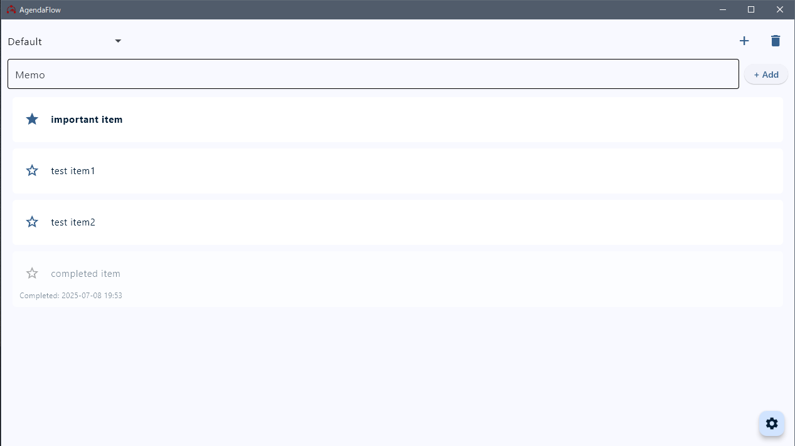

# AgendaFlow

AgendaFlow is a simple and easy-to-use task management application built with the Flet framework. It supports multiple project management, importance tagging, theme customization, and more.



## Features

### Core Features
- **Task Management**: Add, edit, and delete memos/tasks
- **Task Completion**: Easily toggle completion status with swipe actions
- **Importance Tagging**: Mark important tasks with a star (up to 6)
- **Project Management**: Create and manage multiple projects
- **Data Persistence**: Automatically saves settings and task data

### UI/UX Features
- **Swipe Actions**:  
  - Left-to-right swipe: Complete/un-complete task  
  - Right-to-left swipe: Delete task
- **Theme Customization**: Switch between light and dark modes
- **Color Themes**: Choose from 10 color themes
- **Auto Sorting**: Tasks are automatically sorted — Important → Normal → Completed

## Installation

### Required Dependencies

```bash
pip install flet
```

### How to Run

```bash
python agendaflow.py
```

## Usage

### Basic Operations
1. **Add Task**: Enter your memo in the input box and press Enter or click the "Add" button
2. **Edit Task**: Click the task text to edit directly
3. **Set Importance**: Click the star icon to mark/unmark as important
4. **Complete Task**: Swipe the task left to show the complete confirmation dialog
5. **Delete Task**: Swipe the task right to show the delete confirmation dialog

### Project Management
- **Create New Project**: Click the "+" button to create a new project
- **Delete Project**: Click the "Delete" button to remove the current project
- **Switch Projects**: Select a project from the dropdown menu

### Settings Customization
1. Click the floating action button (gear icon) in the lower right corner
2. **Theme Color**: Choose from 10 color themes
3. **Display Mode**: Switch between light and dark modes

## Data Storage

### Windows
```
%LOCALAPPDATA%\AgendaFlow\
├── settings.json            # Application settings
└── todos_[projectname].json # Task data per project
```

### macOS/Linux
```
~/AgendaFlow/
├── settings.json            # Application settings
└── todos_[projectname].json # Task data per project
```

## Technical Details

### Architecture
- **UI Framework**: Flet (Flutter for Python)
- **Data Format**: JSON
- **Settings Management**: File-based persistence
- **Theming**: Material Design compliant

### Key Classes
- **AgendaFlowApp**: Main application class
- **SettingsManager**: Manages application settings
- **TodoManager**: Manages task data

### Additional Features
- **Multiline Support**: Automatic wrapping for long text
- **Real-time Saving**: Edits are saved automatically
- **Confirmation Dialogs**: Confirmation for critical operations

## Customization

### Theme Colors
Ten color themes are available:
- BLUE (default)
- RED
- GREEN
- PINK
- PURPLE
- ORANGE
- INDIGO
- BROWN
- CYAN
- TEAL

### Change Default Settings
Edit the `DEFAULT_SETTINGS` dictionary in your code to change defaults:

```python
DEFAULT_SETTINGS = {
    "theme_settings": {"theme_mode": "LIGHT", "theme_color": "BLUE"},
    "projects": ["Default"],
    "last_project": "Default",
}
```

## Troubleshooting

### Common Issues
1. **App won’t start**: Make sure Flet is installed
2. **Data not saving**: Check for write permissions
3. **Cannot mark important tasks**: The limit is 6 important tasks

### Logs & Debugging
Check the console output when errors occur.

## License

This project is licensed under the MIT License - see the [LICENSE](./LICENSE) file for details.

## Third-party libraries

- Flet (MIT License)
  - Copyright (c) 2022-present, Flet Contributors
  - See LICENSE_flet.txt for details.

## Contribution

Bug reports and feature requests are welcome via GitHub Issues.

## Release Notes

- v1.2: refined GUI
  - looks good in dark mode
  - refactored all code

- v1.1: Added some features
  - Theme customization support
  - Swipe action support

- v1.0: Initial release
  - Basic task management
  - Project management
